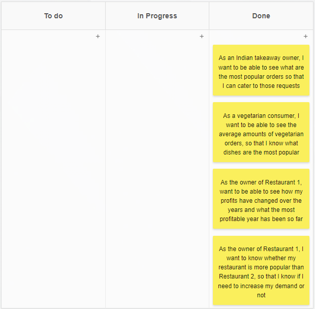

# Indian Takeaway Analysis

The purpose of this project is to analyse a dataset using DataBricks and PySpark to provide value to a business.

I have chosen to analyse a dataset about Indian Takeaway Restaurants between 2015 and 2019. The dataset was in the form of 4 csv files, 2 relating to the orders placed at each restaurant and the other 2 detailing the price of each of the products on the menu. I imported and cleaned these datasets before using PySpark functions to analyse the data and create visualisations.

To view this project, download the Notebook file and import it into DataBricks where it can be run to see all of the analysis and visualisations clearly.

## Planning the project
### Kanban board
I used [Kanban Tool](https://kanbantool.com/free-kanban-board) to create a kanban board where I detailed the user stories for this project along with some acceptance criteria.

Here is what the completed kanban board looks like:

#### User Stories
- As an Indian takeaway owner, I want to be able to see what are the most popular orders so that I can cater to those requests
  - Acceptance Criteria: GIVEN I am on the Databricks Notebook, WHEN I scroll through it, THEN I should easily be able to find what the most popular orders are and how many of those orders were made between 2015 and 2019
- As a vegetarian consumer, I want to be able to see the average amounts of vegetarian orders, so that I know what dishes are the most popular
  - Acceptance Criteria: GIVEN I am on the Databricks notebook, WHEN I scroll through it, THEN I should easily be able to find what the most popular vegetarian orders were between 2015 and 2019.
- As the owner of Restaurant 1,  want to be able to see how my profits have changed over the years and what the most profitable year has been so far
  - Acceptance Criteria: GIVEN I am on the Databricks notebook, WHEN I scroll through it THEN I should be able to easily see how much money was generated each year and compare this to previous years.
- As the owner of Restaurant 1, I want to know whether my restaurant is more popular than Restaurant 2, so that I know if I need to increase my demand or not
  - Acceptance Criteria: GIVEN I am on the Databricks Notebook, WHEN I scroll through it, THEN I should easily be able to compare the takeaway orders from my restaurant with Restaurant 2's.

### Definition of ready
- All user stories and acceptance criteria should be written
- All user stories should be placed in the product backlog ready to be worked on
### Definition of done
- All user stories and acceptance criteria should be completed
- All code is working as intended

## Structure of the report
### Loading the csv files
The 4 files were loaded into the notebook at the start to be used as DataFrames throughout the project.

### Cleaning the data
I cleaned the data that came in from the 4 csv files to ensure there were no duplicate rows and to ensure that the datatypes of the numerical columns were correct so that mathematical calculations could be performed on them later on.

### Analysis and Visualisations
I have broken down each section of analysis into a question to be answered. I then performed certain functions on the data to answer these questions, before creating a visualisation to demonstrate these findings. The observations of what I deduced have been written below each visualisation.

### Conclusions
At the end of the file, there are some general conclusions that I came to based on what I discovered through the visualisations.

